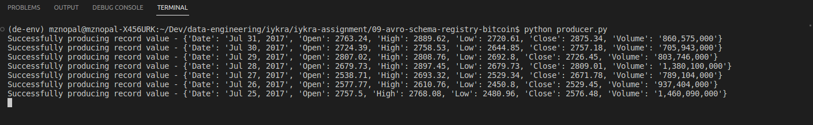
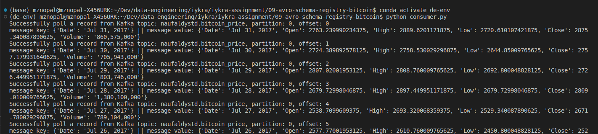

# 09-avro-schema-registry-bitcoin

## How to run
1. Start docker-compose
```bash
docker-compose up -d
```
2. Install dependencies
```bash
pip install -r requirements.txt
```
3. Start the producer
```bash
python producer.py
```
4. Start the consumer
```bash
python consumer.py
```

## Success Scenarion
1. The producer should be able to produce messages to the topic `naufaldystd.bitcoin_price`

2. The consumer should be able to consume messages from the topic `naufaldystd.bitcoin_price`
